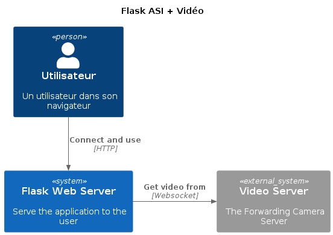

# 4IRC_ASIROS_PLANCHON_EX2

## Comparaison avec flask
- Django est beaucoup plus structuré que flask
- Bottle ressemble beaucoup à flask mais en plus minimal, ce n'est pas un framework mais plus un wrapper autour de la STD

## Lancement du système
Le système se lance avec un simple `start.sh` ou en lançant le serveur vidéo `services/camera.py` et le serveur web `app.py`

## Schema du système

```c4plantuml
@startuml
!include C4_Context.puml

title Flask ASI + Vidéo

Person(user, "Utilisateur", "Un utilisateur dans son navigateur")
System(flask_server, "Flask Web Server", "Serve the application to the user")

System_Ext(video_server, "Video Server", "The Forwarding Camera Server")

Rel(user, flask_server, "Connect and use", "HTTP")
Rel_Neighbor(flask_server, video_server, "Get video from", "Websocket")
@enduml
```

Ici j'ai choisi de rajouter un lien websocket entre le serveur vidéo et le serveur flask afin d'éviter la limitation d'une seule connection par caméra sur linux, cette solution permet au backend flask d'ouvrir N connection websocket sur le serveur vidéo qui ouvrira tout autant de thread pour dupliquer le flux.